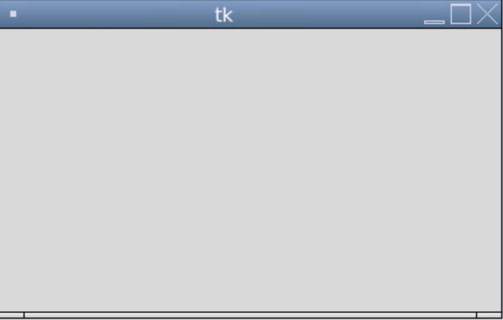
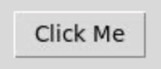
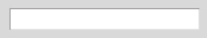
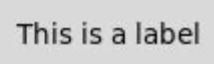
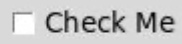
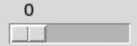
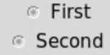

## Tkinter Guide
This guide will cover all basic elements in Tkinter for reference when creating GUIs.

### Setup
#### Installation
Tkinter comes installed with Python but you need to import it to your file to utilize its elements.
`from tkinter import *`
This statement imports everything from Tkinter into your file for use.

`from tkinter` tells python that we want to import certain elements from the Tkinter library.
`import *` import everything, `*` is a way of referencing all elements/files in python.

### Creating a Window
After you have imported Tkinter, getting started is easy.
To create a simple window you only need two more lines of code.

`root = Tk()`. 
- This root variable does not have to be called root, it can be called whatever you want.
- This variable is a way of referencing what frame you want to put your elements in. 
- I call it root because it is the lowest/base frame, just like how roots are the base of a tree. 
- All other frames will be created ontop of your root frame (more about frames later).

`root.mainloop()`
- This is the second line needed to create a working window. 
- This line references the root variable you just created.
- This mainloop() function keeps the window open until it is closed. 
- Without this line, the window would open and close so fast it you wouldn't even be able to see it.

After you have all of this code enetered into your IDE run the program.

A window should open that will look something like the image below (it will look different based on what operating system you are using).



If your window looks something like the image above, congratulations, you just made you first GUI!

To start adding elements you must first learn how to implemnet them and the parameters of each element.

I will only cover the most popular elements, if you want to go in-depth about every element and the parameters it can use, click [here](https://docs.python.org/3/library/tk.html).

### Adding elements to the GUI
To add the elements discussed below to the window, use the .pack() command.

This command adds the element to the window. Without it nothing will show up on the GUI.

For example to add a label (discussed below):

`Label(root, text="This is a label").pack()`

#### Orientation:
To change the position of elements when using .pack() you can use the side parameter.

Here is an example of trying to position a label to the left:

`Label(root, text="This is a label").pack(side=LEFT)`

You can use the positions: TOP, BOTTOM, LEFT, RIGHT (must be capitalized).

### Functions
- Creating functions for Tkinter is almost identical to creating normal Python functions.
- The only difference is the placement of functions. 
- It is usually followed to create your functions above your GUI elements.

| Layout |
| -------| 
| import statements |
| root = Tk() |
| variables |
| functions |
| tkinter elements |
| root.mainloop |

### Basic Elements
**Note**: All elements should be added below your `root = Tk()` line and above your `root.mainloop()` line (including the examples).

#### Frames 

Frames: Frames are like containers that can hold certain elements (like buttons).
- At the start of this tutorial you created a frame called root.
- For simplicity I will only be using the `root` frame but for more advanced GUIs you should use multiple frames to group elements.

#### Button Element

Buttons: Buttons are self-explanatory, you click them, they do something.

Here is what a button's code looks like in Tkinter:

`Button(root, text="Click Me", command=on_click)`

You can see the button takes three parameters:
- `root`: The first parameter is the name of the frame you want the button placed in. Since we are only using one frame, this will be `root`.
- `text`: This is what you want the button to say, this can be a string or an integer.
- `command`: This parameter takes the name of a function to execute when the button is clicked. I'll explain how to create functions for Tkinter late but note, when adding a command do not add brackets at the end of the function name. Adding brackets will run the command when the program is started and not when the button is clicked.

Correct: `Button(command=on_click)`
Incorrect: `Button(command=on_click())`



#### Entry Element
Entry: Entry widgets allow you to enter data in your GUI and process this data using Python.

Here is what a entry's code looks like in Tkinter:

`Entry(root, variable=entry_one)`

You can see the entry takes two parameters:
- `root`: This is the same `root` that buttons use (discussed above).
- `variable`: This allows you to assign the data in the entry element to a variable.
- To properly acess this data you must define your string before assigning it to an entry widget like so:

`entry_one = str()`

This creates a variable called entry_one and tells it to turn the data it receives into a string.

#### Acessing Data 
- To access data in an entry widget you must use a special command called `.get()`.
- If you try printing your assigned variable: `print(entry_one)` you will not be able to see what has been entered in in the entry element.
- `.get()` allows you to normally print the variable like so: `print(entry_one.get())`.



#### Label Element

Label: This element allows you to place labels in your GUIs. This helps the user understand what everything is used for.

Here is what a label's code looks like in Tkinter:

`Label(root, text="This is a label")`

You can see the label takes three parameters:
- `root`: This is the same `root` that buttons use (discussed above).
- `text`: This was also explained in the button section above. 
- This adds text to the label allowing it to display data.
- Not adding the text variable can allow you to use a blank label to split other elements up.



#### Checkbutton Element

Checkbutton: This element allows a user to select or deselect a box. Accesing this box will give you a value of either 0 (not checked) or 1 (checked).

Here is what a checkbutton's code looks like in Tkinter:

`Checkbutton(root, text="Check Me", variable=check_state)`

You can see the checkbutton takes three parameters:
- `root`: This is the same `root` that buttons use (discussed above).
- `text`: This was also explained in the button and label sections above. 
- `variable`: This was explained in the entry section but is a little different when using checkbuttons.
- Instead of defining your variable as `str()`, you must use the `IntVar()` Tkinter function.

`check_state = IntVar()`

Using `.get()` allows you to access the value of the checkbutton.

Here is an example on how to see if the checkbutton is checked:

```
check_state = IntVar()

def is_checkbutton_clicked():
	if check_state.get() == 1:
		print("Checked")
	else:
		print("Not checked")

Checkbutton(root, text="Check Me", variable=check_state).pack()

Button(root, text="Click Me", command=is_checkbutton_clicked).pack()
```



#### Scale Element

Scale: This element allows a user to select a number between two given numbers.

Here is what a scale's code looks like in Tkinter:

`Scale(root, from_=0, to=10, orient=HORIZONTAL, variable=scale_state)`

You can see the scale takes five parameters:
- `root`: This is the same `root` that buttons use (discussed above).
- `from_`: This parameter define the minimum number the user can select.

**NOTE**: Always include the _ after from.
- `to`: This parameter defines the maximum number the user can select.
- `orient`: This parameter defines how the scale element is placed. By default, the scale will be placed vertically (up-down).
- Adding `orient: HORIZONTAL` placed the scale horizontally in the window (left-right).

**NOTE**: `HORIZONTAL/VERTICAL` and other orientation paramaters in Tkinter must be capitalized.

- `variable`: This is the same as the checkbutton. The variable must be defined as an `IntVar()`.

Here is an example on how to see the selected number on the scale:

```
scale_state = IntVar()

def print_scale():
	print(scale_state.get())

Scale(root, from_=0, to=10, orient=HORIZONTAL, variable=scale_state).pack()

Button(root, text="Click", command=print_scale).pack()
```



#### Radiobutton Element

Radiobutton: This element allows a user to select a checkbutton with some special features.

Here is what a radiobutton's code looks like in Tkinter:

```
Radiobutton(root, text="First", value="first", variable=radio_state)

Radiobutton(root, text="Second", value="second", variable=radio_state)
```

You can see I gave the example of two radiobuttons. 

This is because you can configure the buttons to allow the user to only select one (like a muktiple choice question on a test).

You can see the radiobutton takes four parameters:
- `root`: This is the same `root` that buttons use (discussed above).
- `text`: This was also explained in the button and label sections above. 
- `value`: This value is what you will see when you print the state of the selected radiobutton. 
- Make the value something you will be able to recognize and make every radiobutton have a different value.
- `variable`: This should be the variable the correpsonds with the state of the radiobuttons. 
- The variable should be the same in every radiobutton in a section as it ensures only one can be clicked.
- When creatijng your variable, use the `StringVar()` command instead of the `IntVar()` command as using `.get()` on your variable will return your `value` (usually a string).

Here is an example on how to see which radiobutton is selected:

```
radio_state = StringVar()

def print_radio():
	print(radio_state.get())

Radiobutton(root, text="First", value="first", variable=radio_state).pack()

Radiobutton(root, text="Second", value="second", variable=radio_state).pack()

Button(root, text="Click Me", command=print_radio).pack()
```

