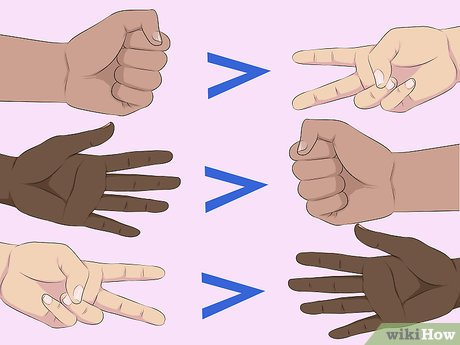

## Programming Club (2021): #8

### Replit
To run your program:
Click on the shell tab (to the right)
Type ```python files/yourname.py``` and click ```enter```.

### Challenges
Work **with a partner** to solve one or more of these challenges.

**1. Reversed Messages ([Solution](https://replit.com/@jackokeeffe/Programming-Club-2021-8#reverse.py))**
- You will be given two lists filled with words.
- Check if the words in the second list are the reversed versions of the words in the first list.
- Make sure to check through every item in the list!
- A template list can be found [here](https://replit.com/@jackokeeffe/Programming-Club-2021-8#reverseTemplate.py), feel free to change the words in the list.

**2. Move this List ([Solution](https://replit.com/@jackokeeffe/Programming-Club-2021-8#moveList.py))**
- Write a function that rotates a list by k elements.
- If k was 3 and your list was [1, 2, 3, 4, 5], your new list will be [4, 5, 1, 2, 3]
- Your program should work with different k values.
- Inspiration for this problem comes from: https://bit.ly/3cIGHXW

**3. Rock Paper Scissors! ([Solution](https://replit.com/@jackokeeffe/Programming-Club-2021-8#rockPaperScissors.py))**
- This can be a challenging program so make sure to brainstorm how you want to approach it before starting to code.
- As a challenge, try to keep your code as short as possible! 
- Here are the rules to Rock Paper Scissors: 


<br>
Image from [WikiHow](https://www.wikihow.com/Play-Rock,-Paper,-Scissors)

### Resources
WikiHow: [Rock Paper Scissors Rules](WikiHow](https://www.wikihow.com/Play-Rock,-Paper,-Scissors))

[Github](https://github.com/jackokeeffe/programming-club): Where all the code answers/solutions will be stored.
